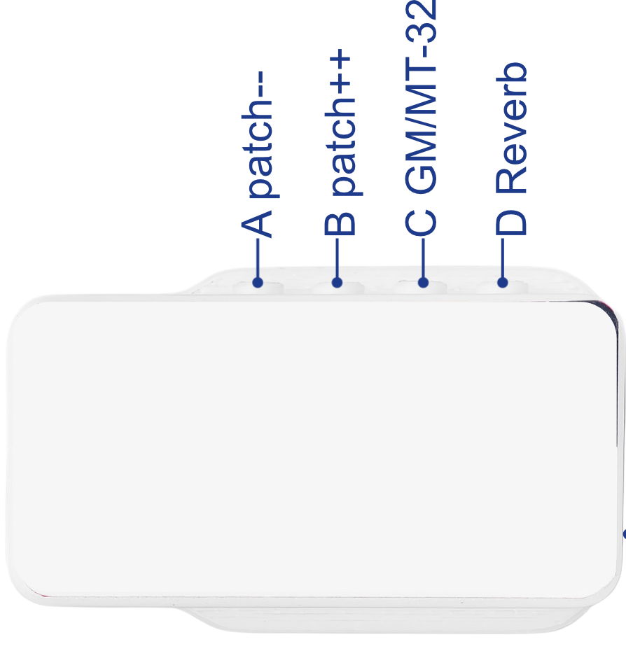

# ESP32-SAM2695-Synth

This project turns a Seeed Studio XIAO ESP32 board into a powerful, wireless **BLE MIDI Synthesizer** using the SAM2695 audio synth chip.

It receives MIDI messages (like key presses, control changes, and program changes) over Bluetooth LE (and USB on the ESP32-S3) and forwards them to the SAM2695 chip, which generates the audio. This is designed for boards like the [XIAO MIDI Synthesizer](https://wiki.seeedstudio.com/xiao_midi_synthesizer/).

## Inspiration

Inspired by this video, I decided to buy a XIAO Synth and extend the firmware:

## ✨ Features

* **Bluetooth MIDI:** Receives MIDI notes and commands over Bluetooth LE (BLE)

* **Dual Interface (ESP32-S3):** The ESP32-S3 version creates both a BLE MIDI and a **USB MIDI** interface simultaneously. Note that the ESP32-C3 does not support USB OTG, thus no simple solution for USB MIDI is available for the ESP32-C3.

* **Multi-Platform:** Supports Seeed Studio's XIAO **ESP32-S3**, **ESP32-C3**, and **ESP32-C6** boards

* **On-board Controls:** Use four physical buttons for direct control over program changes, sound bank, and reverb

* **Dual Sound Banks:** Switch between the standard **General MIDI (GM)** bank and an **MT-32 Compatible** bank 

* **Remote MIDI Control:** Change programs and banks using custom MIDI CC messages from any connected controller

* **Standard MIDI Support:** Responds to Program Change, Volume (CC #7), Reverb (CC #91), and many other standard CCs - and even NRPN and SysEx.

* **Connection LED:** An LED indicates BLE connection status (On = Connected) - you have to connect your own LED to the XIAO ESP32-C3 (to pin 10) while the ESP32-S3 has an onboard LED.

## 🎛️ Controls & Sound Banks

You can control the synthesizer using the four physical buttons (defined in `main.cpp`) or by sending specific MIDI messages. The firmware supports two distinct sound banks on the SAM2695 chip.

* **Bank 0 (Default): General MIDI (GM)**

  * This is the standard 128-instrument GM sound set.

  * Selected by sending MIDI CC #0 with a value of `0`.

* **Bank 127: MT-32 Compatible**

  * This bank contains 128 alternate instruments compatible with the classic Roland MT-32 synthesizer.

  * Selected by sending MIDI CC #0 with a value of `127`.

### Physical Buttons

The four physical buttons are hard-coded to send MIDI commands on **Channel 1**. This is great if you want to navigate through all available sounds.

| Button | ESP32-C3 Pin | Function | Description | 
 | ----- | ----- | ----- | ----- | 
| **A** | `5` | **Program Decrease** | Decrements the program number (patch) on Channel 1. | 
| **B** | `4` | **Program Increase** | Increments the program number (patch) on Channel 1. | 
| **C** | `3` | **Toggle Bank** | Toggles between GM Bank (0) and MT-32 Bank (127) on Channel 1. | 
| **D** | `2` | **Toggle Reverb** | Toggles the Reverb Send (CC #91) between 0 (Off) and 96 (On) for Channel 1. | 

### MIDI Control Change (CC) Implementation

The firmware responds to the following standard and custom MIDI CC messages on any channel. Custom controls specific to this project are marked.

| Decimal | Hex | Name | Description | 
 | ----- | ----- | ----- | ----- | 
| 0 | 0x00 | Bank Select | Selects sound bank. `0` = GM, `127` = MT-32 | 
| 1 | 0x01 | Modulation | Standard modulation wheel | 
| 5 | 0x05 | Portamento Time | Controls portamento time  | 
| 6 | 0x06 | Data Entry MSB | Used for RPN/NRPN data entry | 
| 7 | 0x07 | Volume | Channel volume | 
| 10 | 0x0A | Pan | Channel pan | 
| 11 | 0x0B | Expression | Channel expression | 
| **13** | **0x0D** | **Toggle Bank (Custom)** | **(Project Specific)** Toggles bank for the channel (GM/MT-32) | 
| **14** | **0x0E** | **Program Decrease (Custom)** | **(Project Specific)** Decrements program number for the channel | 
| **15** | **0x0F** | **Program Increase (Custom)** | **(Project Specific)** Increments program number for the channel | 
| 64 | 0x40 | Sustain Pedal | Damper/Sustain on/off | 
| 65 | 0x41 | Portamento On/Off | Toggles portamento | 
| 66 | 0x42 | Sostenuto Pedal | Sostenuto on/off | 
| 67 | 0x43 | Soft Pedal | Soft pedal on/off | 
| 80 | 0x50 | Reverb Program | Selects reverb type (0-7). (DREAM Specific) | 
| 81 | 0x51 | Chorus Program | Selects chorus type (0-7). (DREAM Specific) | 
| 91 | 0x5B | Reverb Send Level | Controls reverb send level (0-127) | 
| 93 | 0x5D | Chorus Send Level | Controls chorus send level (0-127) | 
| 98 | 0x62 | NRPN LSB | Non-Registered Parameter Number LSB | 
| 99 | 0x63 | NRPN MSB | Non-Registered Parameter Number MSB | 
| 100 | 0x64 | RPN LSB | Registered Parameter Number LSB | 
| 101 | 0x65 | RPN MSB | Registered Parameter Number MSB | 
| 120 | 0x78 | All Sound Off | Mutes all sound on the channel | 
| 121 | 0x79 | Reset All Controllers | Resets controllers to default | 
| 123 | 0x7B | All Notes Off | Stops all playing notes | 
| 126 | 0x7E | Mono On | Enables monophonic operation | 
| 127 | 0x7F | Poly On | Enables polyphonic operation (default) | 

*Note: All other NRPNs (Non-Registered Parameter Numbers) listed in the SAM2695 datasheet (e.g., for EQ, Mike Echo) are also supported via CCs 99/98/6*.

## 🚀 Easy Installation (Web Flasher)

You can flash the latest pre-compiled firmware directly from your browser (Chrome or Edge).

https://www.rene-bohne.de/esp32-SAM2695-synth/web_flasher

1. Plug in your XIAO board.

2. Put it into **bootloader mode**: Hold the **BOOT** button, press the **RESET** button, then release the **BOOT** button.

3. Click the link above and select your board.

4. Click "Install" and select the correct serial port (e.g., `... (COMX)` or `... (cu.usbmodem)`) to install the firmware.

## 🛠️ Building from Source (pioarduino)

This project is built using PlatformIO, but it requires a specific version of the ESP32 Arduino Core (v3.3.3) that is not available in the standard PlatformIO registry.

To compile this, you **must use the pioarduino IDE extension for VS Code**, which is designed to work with this custom platform. The standard "PlatformIO IDE" extension will not work.

### Dependencies

The project is already configured to automatically install this library on build:

* [**Control-Surface**](https://github.com/tttapa/Control-Surface): Used for handling the BLE and USB MIDI callbacks.

### How to Compile

1. Clone this repository.

2. Ensure you have the **pioarduino IDE** extension installed in VS Code (and not the standard PlatformIO IDE).

3. Open the `BLE` folder in VSCode.

4. Select your board environment from the pioarduino sidebar:

   * `esp32c3` (for XIAO ESP32-C3)
   * `esp32s3` (for XIAO ESP32-S3)
   * `esp32c6` (for XIAO ESP32-C6)

5. Click "Build" or "Upload".

## Patches

The SAM2596 has two banks with 128 patches each. It hast five different drums sets. Here is are lists of the available options:

### Bank 0: General MIDI Patches

These are the standard General MIDI instruments, selected when Bank 0 is active.

| PC | Instrument | PC | Instrument | PC | Instrument | PC | Instrument | 
 | ----- | ----- | ----- | ----- | ----- | ----- | ----- | ----- | 
| 1 | (Grand) Piano 1 | 33 | Acoustic Bass | 65 | Soprano Sax | 97 | FX 1 (rain) | 
| 2 | (Bright) Piano 2 | 34 | Finger Bass | 66 | Alto Sax | 98 | FX 2 (soundtrack) | 
| 3 | (El. Grd) Piano 3 | 35 | Picked Bass | 67 | Tenor Sax | 99 | FX 3 (crystal) | 
| 4 | Honky-tonk Piano | 36 | Fretless Bass | 68 | Baritone Sax | 100 | FX 4 (atmosphere) | 
| 5 | El. Piano 1 | 37 | Slap Bass 1 | 69 | Oboe | 101 | FX 5 (brightness) | 
| 6 | El. Piano 2 | 38 | Slap Bass 2 | 70 | English Horn | 102 | FX 6 (goblins) | 
| 7 | Harpsichord | 39 | Synth Bass 1 | 71 | Bassoon | 103 | FX 7 (echoes) | 
| 8 | Clavi | 40 | Synth Bass 2 | 72 | Clarinet | 104 | FX 8 (sci-fi) | 
| 9 | Celesta | 41 | Violin | 73 | Piccolo | 105 | Sitar | 
| 10 | Glockenspiel | 42 | Viola | 74 | Flute | 106 | Banjo | 
| 11 | Music Box | 43 | Cello | 75 | Recorder | 107 | Shamisen | 
| 12 | Vibraphone | 44 | Contrabass | 76 | Pan Flute | 108 | Koto | 
| 13 | Marimba | 45 | Tremolo Strings | 77 | Blown Bottle | 109 | Kalimba | 
| 14 | Xylophone | 46 | Pizzicato Strings | 78 | Shakuhachi | 110 | Bag pipe | 
| 15 | Tubular Bells | 47 | Orchestral Harp | 79 | Whistle | 111 | Fiddle | 
| 16 | Santur | 48 | Timpani | 80 | Ocarina | 112 | Shanai | 
| 17 | Drawbar Organ | 49 | String Ensemble 1 | 81 | Lead 1 (square) | 113 | Tinkle Bell | 
| 18 | Percussive Organ | 50 | String Ensemble 2 | 82 | Lead 2 (sawtooth) | 114 | Agogo | 
| 19 | Rock Organ | 51 | Synth Strings 1 | 83 | Lead 3 (calliope) | 115 | Steel Drums | 
| 20 | Church Organ | 52 | Synth Strings 2 | 84 | Lead 4 (chiff) | 116 | Woodblock | 
| 21 | Reed Organ | 53 | Choir Aahs | 85 | Lead 5 (charang) | 117 | Taiko Drum | 
| 22 | Accordion (french) | 54 | Voice Oohs | 86 | Lead 6 (voice) | 118 | Melodic Tom | 
| 23 | Harmonica | 55 | Synth Voice | 87 | Lead 7 (fifths) | 119 | Synth Drum | 
| 24 | Tango Accordion | 56 | Orchestra Hit | 88 | Lead 8 (bass+lead) | 120 | Reverse Cymbal | 
| 25 | Ac. Guitar (nylon) | 57 | Trumpet | 89 | Pad 1 (fantasia) | 121 | Gt. Fret Noise | 
| 26 | Ac. Guitar (steel) | 58 | Trombone | 90 | Pad 2 (warm) | 122 | Breath Noise | 
| 27 | El. Guitar (jazz) | 59 | Tuba | 91 | Pad 3 (polysynth) | 123 | Seashore | 
| 28 | El. Guitar (clean) | 60 | Muted Trumpet | 92 | Pad 4 (choir) | 124 | Bird Tweet | 
| 29 | El. Guitar (muted) | 61 | French Horn | 93 | Pad 5 (bowed) | 125 | Teleph. Ring | 
| 30 | Overdriven Guitar | 62 | Brass Section | 94 | Pad 6 (metallic) | 126 | Helicopter | 
| 31 | Distortion Guitar | 63 | Synth Brass 1 | 95 | Pad 7 (halo) | 127 | Applause | 
| 32 | Guitar harmonics | 64 | Synth Brass 2 | 96 | Pad 8 (sweep) | 128 | Gunshot | 

### Bank 127: MT-32 Compatible Patches

These are the alternate MT-32 compatible instruments, selected when Bank 127 is active. In order to activate them, you must send CC0 value 127 followed by the PC with the corrisponding value from this table:

| PC | Instrument | PC | Instrument | PC | Instrument | PC | Instrument | 
 | ----- | ----- | ----- | ----- | ----- | ----- | ----- | ----- | 
| 1 | Piano 1 | 2 | Piano 2 | 3 | Piano 3 | 4 | Detuned EP 1 | 
| 5 | E.Piano 1 | 6 | E.Piano 2 | 7 | Detuned EP 2 | 8 | Honky-Tonk | 
| 9 | Organ 1 | 10 | Organ 2 | 11 | Organ 3 | 12 | Detuned Or. 1 | 
| 13 | Church Org. 2 | 14 | Church Org. 3 | 15 | Church Org. 3 | 16 | Accordion Fr. | 
| 17 | Coupled Hps. | 18 | Coupled Hps. | 19 | Harpsichord | 20 | Clav. | 
| 21 | Clav. | 22 | Clav. | 23 | Celesta | 24 | Celesta | 
| 25 | Synth Brass 2 | 26 | Synth Brass 1 | 27 | Synth Brass 3 | 28 | Synth Brass 4 | 
| 29 | Synth Bass 2 | 30 | Synth Bass 1 | 31 | Synth Bass 3 | 32 | Synth Bass 4 | 
| 33 | Fantasia | 34 | Syn Calliope | 35 | Choir Aahs | 36 | Bowed Glass | 
| 37 | Soundtrack | 38 | Atmosphere | 39 | Crystal | 40 | Bag Pipe | 
| 41 | Tinkle Bell | 42 | Ice Rain | 43 | Oboe | 44 | Pan Flute | 
| 45 | Charang | 46 | Tubular Bells | 47 | Saw Wave | 48 | Square Wave | 
| 49 | Strings | 50 | Tremolo Str. | 51 | Slow Strings | 52 | Pizzicato Str. | 
| 53 | Violin | 54 | Viola | 55 | Cello | 56 | Cello | 
| 57 | Contrabass | 58 | Harp | 59 | Harp | 60 | Nylon-str. Gt | 
| 61 | Chorus Gt. | 62 | Steel-Str. Gt | 63 | Funk Gt. | 64 | Sitar | 
| 65 | Fingered Bs. | 66 | Acoustic Bs. | 67 | Picked Bs. | 68 | Fretless Bs. | 
| 69 | Slap Bs. 2 | 70 | Slap Bs. 1 | 71 | Fretless Bs. | 72 | Fretless Bs. | 
| 73 | Flute | 74 | Flute | 75 | Piccolo | 76 | Piccolo | 
| 77 | Recorder | 78 | Pan Flute | 79 | Soprano Sax | 80 | Alto Sax | 
| 81 | Tenor Sax | 82 | Baritone Sax | 83 | Clarinet | 84 | Clarinet | 
| 85 | Oboe | 86 | English Horn | 87 | Bassoon | 88 | Harmonica | 
| 89 | Trumpet | 90 | Muted Trumpet | 91 | Trombone | 92 | Trombone | 
| 93 | French Horn | 94 | Tuba | 95 | French Horn | 96 | Brass | 
| 97 | Vibraphone | 98 | Vibraphone | 99 | Brass 2 | 100 | Kalimba | 
| 101 | Tinkle Bell | 102 | Glockenspiel | 103 | Tubular-Bell | 104 | Xylophone | 
| 105 | Marimba | 106 | Koto | 107 | Taisho Koto | 108 | Shakuhachi | 
| 109 | Whistle | 110 | Bottle Blow | 111 | Whistle | 112 | Pan Flute | 
| 113 | Timpani | 114 | Melo Tom | 115 | Melo Tom | 116 | Synth Drum | 
| 117 | Taiko | 118 | Synth Drum | 119 | Taiko | 120 | Reverse Cym. | 
| 121 | Castanets | 122 | Tinkle Bell | 123 | Orchestra Hit | 124 | Telephone | 
| 125 | Bird | 126 | Helicopter | 127 | Bowed Glass | 128 | Ice Rain | 

### Drum Kits (MIDI Channel 10)

The SAM2695 provides multiple drum kits on MIDI Channel 10, selectable via Program Change messages. The following table details the note map for the most common kits.

| Note | PC 1: Standard / PC 17: Power | PC 41: Brush | PC 49: Orchestra | PC 128: CM-64/32 |
|:---|:---|:---|:---|:---|
| 35 | Kick drum 2 | Jazz BD 2 | | Kick drum |
| 36 | Kick drum 1 | Jazz BD 1 | | Kick drum |
| 37 | Side Stick | | | Rim Shot |
| 38 | Snare Drum 1 / Gated Snare | Brush Tap | Snare Drum 2 | Snare Drum |
| 39 | Hand Clap | Brush Slap | Castanets | Hand Clap |
| 40 | Snare Drum 2 | Brush Swirl | Snare Drum 2 | Elec Snare Drum |
| 41 | Low Floor Tom | | Timpani F | Acoustic Low Tom |
| 42 | Closed Hi Hat [EXC1] | | Timpani F# | Closed Hi-Hat [Exc1] |
| 43 | High Floor Tom | | Timpani G | Acoustic Low Tom |
| 44 | Pedal Hi-Hat [EXC1] | | Timpani G# | Open Hi-Hat 2 |
| 45 | Low Tom | | Timpani A | Acoustic Middle Tom |
| 46 | Open Hi-Hat [EXC1] | | Timpani A# | Open Hi-Hat 1 [Exc1] |
| 47 | Low-Mid Tom | | Timpani B | Acoustic Middle Tom |
| 48 | Hi Mid Tom | | Timpani c | Acoustic High Tom |
| 49 | Crash Cymbal 1 | | Timpani c# | Crash Cymbal |
| 50 | High Tom | | Timpani d | Acoustic High Tom |
| 51 | Ride Cymbal 1 | | Timpani d# | Ride Cymbal |
| 52 | Chinese Cymbal | | Timpani e | |
| 53 | Ride Bell | | Timpani f | |
| 54 | Tambourine | | | Tambourine |
| 55 | Splash Cymbal | | | |
| 56 | Cowbell | | | Cowbell |
| 57 | Crash Cymbal 2 | | | |
| 58 | Vibraslap | | | |
| 59 | Ride Cymbal 2 | | | |
| 60 | Hi Bongo | | | |
| 61 | Low Bongo | | | |
| 62 | Mute Hi Conga | | | |
| 63 | Open Hi Conga | | | |
| 64 | Low Conga | | | |
| 65 | High Timbale | | | |
| 66 | Low Timbale | | | |
| 67 | High Agogo | | | |
| 68 | Low Agogo | | | |
| 69 | Cabasa | | | |
| 70 | Maracas | | | |
| 71 | Short Whistle [EXC2] | | | |
| 72 | Long Whistle [EXC2] | | | |
| 73 | Short Guiro [EXC3] | | Vibra Slap | |
| 74 | Long Guiro [EXC3] | | | |
| 75 | Claves | | | Claves |
| 76 | Hi Wood Block | | | |
| 77 | Low Wood Block | | | |
| 78 | Mute Cuica [EXC4] | | | |
| 79 | Open Cuica [EXC4] | | | |
| 80 | Mute Triangle [EXC5] | | | |
| 81 | Open Triangle [EXC5] | | | |
| 82 | | | Applauses | |
| 88 | | | Applauses | |
| 94 | | | | Helicopter |
| 96 | | | | Gun Shot |
| 102 | | | | Birds |
| 106 | | | | SeaShore |

* **Blank cells:** Same sound as the "Standard Set".
* **[EXC]**: Sounds with the same EXC number are mutually exclusive (e.g., Open Hi-Hat cuts off Closed Hi-Hat).

## 📜 License

This project is licensed under the MIT License.
